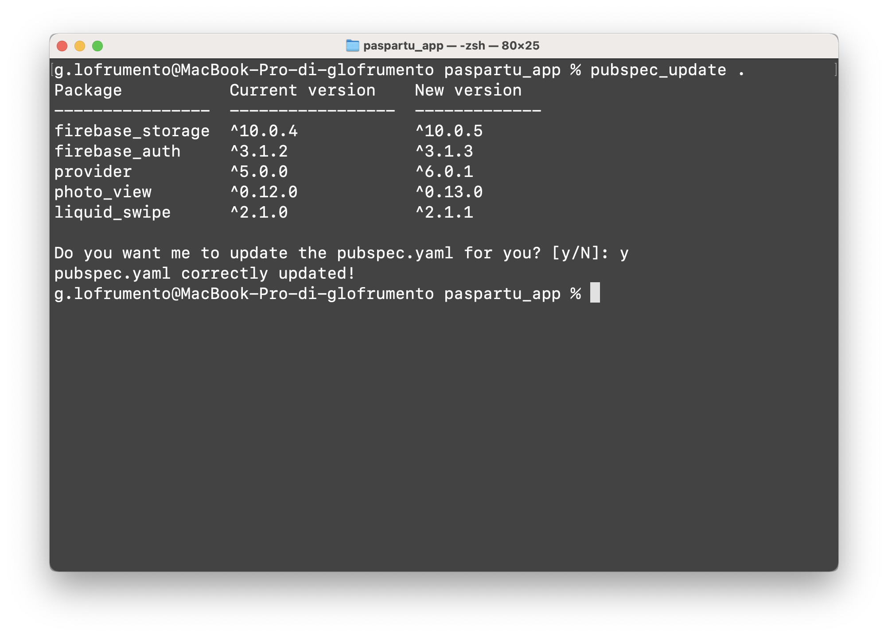

# Flutter pubspec.yaml updater

A simple tool that updates your *pubspec.yaml* file, of a Flutter project, without altering the structure of your file.

## Install

Just run `INSTALL.sh`, this will add the command `pubspec_update` in your terminal.

## Usage

Run `pubspec_update` passing as an argument either the path of the Flutter project or the *pubspec.yaml* file. Example:

- `pubspect_update ~/my/flutter/project`
- `pubspect_update ~/my/flutter/project/pubspec.yaml`

The tool will print a table with all the packages that need an update. This table contains the package name, the current version in the *pubspec* and the newer version available on [pub.dev]().

After the table, it will be asked you whether you want the tool to update directly the *pubspec.yaml* file. This will not alter your file structure at all — comments will stay, order or the package will stay, etc.
